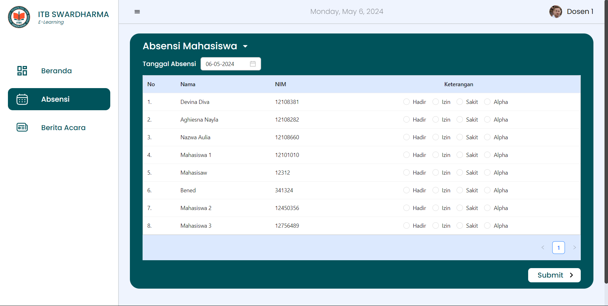
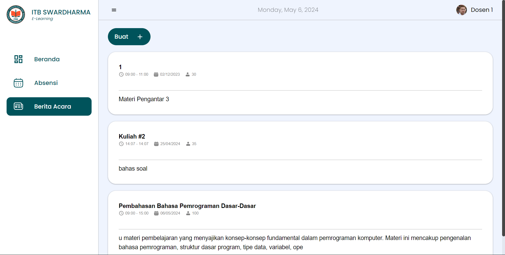
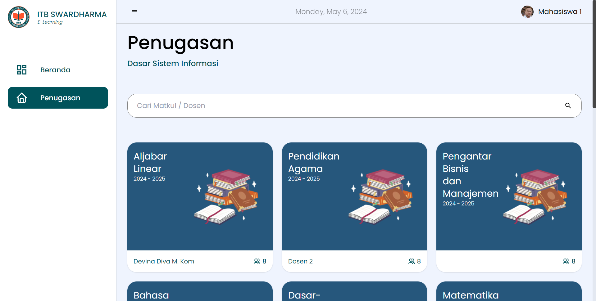

# SIM PERKULIAHAN

<h1>Login Page</h1>

Mengamankan akses ke halaman-halaman atau fitur-fitur tertentu yang hanya boleh diakses oleh pengguna yang sudah terdaftar dengan memasukkan informasi identifikasi, seperti username atau email, dan kata sandi (password).

<h1>Buat Akun Dosen</h1>

Fitur yang berfungsi untuk menambahkan atau membuat informasi mengenai dosen ke dalam halaman yang khusus untuk dosen-dosen tersebut.

<h1>Buat Akun Mahasiswa</h1>

Fitur yang berfungsi untuk menambahkan atau membuat informasi mengenai mahasiswa ke dalam halaman yang khusus untuk mahasiswa-mahasiswa tersebut.

<h1>Buat Acara</h1>

Fitur yang berfungsi untuk menambahkan atau membuat suatu acara yang akan dilaksanakan. Sekaligus menyediakan informasi tentang tempat, waktu dan status acara yang akan dilakukan tersebut.

  

<h1>Halaman Utama Dosen</h1>

Menampilkan berbagai mata kuliah untuk dosen dengan memaparkan judul mata kuliah serta tahun ajaran. Di dalamnya juga menyediakan daftar tugas yang sudah dibuat oleh dosen, serta dapat memberikan nilai pada mahasiswa yang sudah mengirim tugasnya.

<h1>Absensi Mahasiswa</h1>

Fitur yang berfungsi untuk mencatat kehadiran mahasiswa setiap harinya oleh dosen yang bersangkutan. Disediakan juga fitur filter berdasarkan tanggal.

<h1>Absensi Mahasiswa</h1>

Fitur yang berfungsi untuk membuat acara untuk mahasiswa yang disediakan oleh dosen sesuai mata kuliah yang bersangkutan.

  

<h1>Halaman Utama Mahasiswa</h1>

Menampikan berbagai mata kuliah yang sudah dibuat oleh Admin dengan disisipkan dosen yang bersangkutan untuk mata kuliah tersebut. Halaman tersebut juga menampilkan daftar tugas yang sudah dibuat oleh admin dan detail terkait tugas yang dibuat sehingga mahasiswa dapat mengerjakan dan mengirim ke dosen.

  

This template provides a minimal setup to get React working in Vite with HMR and some ESLint rules.

Currently, two official plugins are available:

- [@vitejs/plugin-react](https://github.com/vitejs/vite-plugin-react/blob/main/packages/plugin-react/README.md) uses [Babel](https://babeljs.io/) for Fast Refresh
- [@vitejs/plugin-react-swc](https://github.com/vitejs/vite-plugin-react-swc) uses [SWC](https://swc.rs/) for Fast Refresh
  "# sim-perkuliahan"
